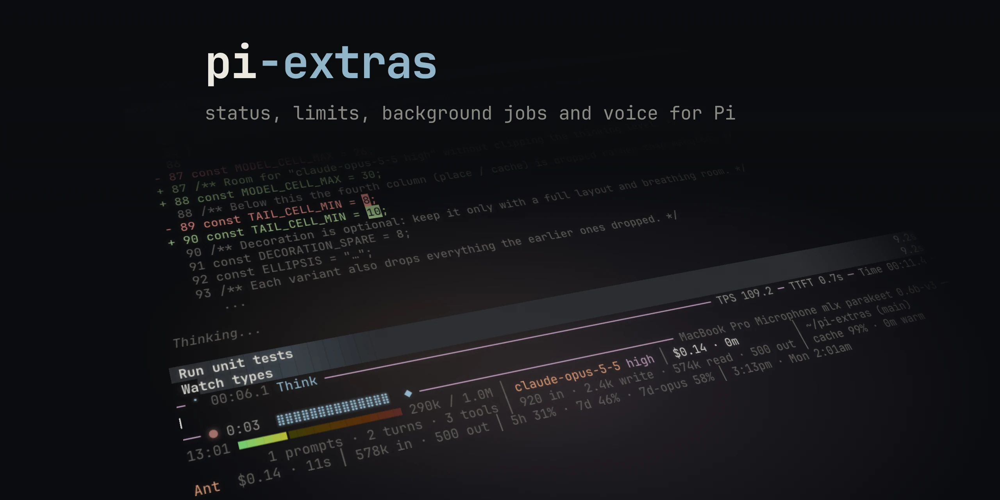

Optional extensions and a theme for [Pi](https://pi.dev): a richer footer,
usage-limit awareness for the agent, activity and timing indicators, background
shell jobs, bounded shell execution, Kagi subscription search, local voice
dictation, and clearer tool rows.

## Install

Requires Pi **0.87.0 or newer**, Node **22.18 or newer**, npm and Git.
The shell-job extension currently targets macOS and Linux with a POSIX shell.
Windows process-group behavior has not been validated.

```sh
pi install git:github.com/jaedync/pi-extras
```

Restart Pi after installation. Use `pi config` to select extensions. Installing
adds all ten extensions (computer use stays off until you opt in); it makes `quiet` available but does not select it.
Choose the theme using `/settings`. Use only one custom footer at a time.
Phase Spinner wraps an existing editor where possible; other editor extensions
can still conflict.

| Component | Behavior |
| --- | --- |
| Status Plus | Usage/cost grid, context and cache indicators, per-provider limits, optional linked subagent usage |
| Usage Guard | `usage` tool, `/usage` command, one-shot wrap-up warnings for a session budget or, when enabled, near a limit |
| Phase Spinner | Working phases, tokens/sec, time to first token, elapsed time, and compaction/retry status with its own timer in the editor border |
| Shell Jobs | `shell_job_start`, `shell_job`, `/jobs`, bounded logs and completion notifications; jobs are named after their titles |
| Bash Default Timeout | Adds a 120-second timeout only when a bash call omitted one |
| Kagi Search | Adds `kagi_search` without replacing existing search/fetch tools |
| Voice | Hold or tap ctrl+space to dictate into the editor, transcribed on this machine |
| Computer Use | Opt-in, macOS: a `computer_use` tool that operates Mac apps through OpenAI's Computer Use, installed by the ChatGPT app |
| Tool Display | Every tool row as a colored header band with live progress and a popup with the whole call, other extensions' tools included; chained bash commands broken into steps; thinking as a live tail of its newest lines |
| Release Notes | What changed in pi-extras, shown once in the first new session after an update; `/pi-extras changelog` shows it again |
| Quiet | Low-contrast theme with restrained accent colors |

## Updates and removal

```sh
pi update --extensions
# Or update Pi and packages together:
pi update --all
pi remove git:github.com/jaedync/pi-extras
```

An unpinned Git install follows upstream commits. Pi can detect available package
updates, but this package does not install an automatic updater or background
service. To pin a published tag, append `@v0.1.0` to the Git source once that tag
exists. Pinned installs require an explicit installation of a newer tag.
After an update, restart Pi or use `/reload`; stop active jobs before removing
the package. Removing it does not remove your credentials or change other packages.

## Configuration

- `STATUSLINE_TZ`: optional IANA timezone for footer clock/reset labels; defaults
  to the system timezone.
- `STATUS_PLUS_POLL_LIMITS=0`: disable authenticated quota polling while retaining
  recorded usage and response-header limits. `PI_OFFLINE` also suppresses polling.
- `PI_EXTRAS_USAGE_GUARD=1` or `0`: turn band warnings on or off for one run.
  See below for the persistent setting.
- `PI_CODING_AGENT_DIR/pi-extras.json` (default `~/.pi/agent/pi-extras.json`):
  persistent Usage Guard settings under `usageGuard`, written by
  `/usage warnings on|off`. Keys: `enabled` (default `false`), `bands`
  (default `[90, 95]`), `resumeMarginSeconds` (default `300`), `proximityPct`
  (default `10`).
- `PI_BASH_DEFAULT_TIMEOUT`: seconds; `0` or `off` disables the injected timeout.
  Explicit per-call timeouts are preserved.
- `PI_CACHE_RETENTION=long`: use the longer cache-warmth indicator window.
- `PHASE_SPINNER_DEBUG=1`: opt-in local timing diagnostics. Leave off normally.
- `PI_VOICE=off`: disable voice dictation. `PI_VOICE_KEY`: a different key
  (default `ctrl+space`). `PI_VOICE_HOME`: where voice keeps its runtime,
  models and settings (default `~/.cache/pi-extras/voice`, or under
  `XDG_CACHE_HOME`).
- `PI_COMPUTER_USE=on`: enable computer use on macOS. Off by default. See below.
- `PI_TOOL_DISPLAY=off`: leave Pi's own tool rows in place. `/tool-display`
  writes its switches under `toolDisplay` in `pi-extras.json`: `enabled`,
  `others` (default `true`), `chains` (default `true`), `motion` (`full` or
  `reduced`) and `thinking` (`tail`, `collapsed` or `full`; default `tail`).
- `statusPlus.toolCount` in `pi-extras.json`: `calls` (the default) or `steps`,
  switched by clicking the footer's tool count or with `/tool-display count`.
- `releaseNotes.seen` in `pi-extras.json`: the last pi-extras version whose
  notes were shown.
- `KAGI_TOKEN_FILE`: path to your own subscription session credential. See below.
- `KAGI_TOOL_NAME=web_search`: explicit search-tool replacement. Leave unset to
  keep `kagi_search` and avoid conflicting with another search extension.

See [security and privacy](docs/security.md) before enabling provider-limit polling
or supplying search credentials. Extensions execute with your user permissions.

## Usage Guard

Usage Guard reads the limit snapshots Status Plus polls; it never fetches on its
own except when the `usage` tool is called with `refresh: true`. Only windows that
govern the active model count: provider-wide windows always, model-specific ones
(such as an Anthropic `seven_day_fable` bucket) only when the active model id
carries that family. Balances (Enterprise spend, prepaid credits) and per-minute
rate limits taken from response headers are reported but never warned on.

- `usage` tool: percent used, thresholds, reset time, seconds until reset and
  `resumeAfterSeconds` (reset plus margin) per window. `setBudget` records a
  session budget ("work until 60% of the weekly limit"); `all` includes other
  providers and non-governing windows.
- Warnings are off by default: only a session budget warns, once, when its
  window is reached. `/usage warnings on` adds band warnings (90 and 95 by
  default) and provider blocks. Each fires once per window, threshold and reset
  cycle, at turn end, as a message appended to context (no system-prompt
  change, no cache miss). Resets reported within ten minutes of each other
  count as one cycle, since proxies recompute them on every fetch. The final
  message asks the agent to wrap up and report; a model-scoped window notes
  that other models are unaffected. Fired keys and the budget persist with the
  session, so a resumed session does not repeat them.
- `/usage` queues the current snapshot for the next turn; `/usage budget 7d 60`
  and `/usage budget clear` manage the session budget; `/usage warnings on|off`
  persists the toggle.
- Polling: providers whose window sits within `proximityPct` of a threshold poll
  at their faster cadence; failed polls back off exponentially up to ten minutes.

## Voice

Hold ctrl+space and speak, or tap it to start and tap again to stop. Esc
discards the recording, including after you stop while it is still being
transcribed. The transcript is typed into the editor and never sent
on its own; review it and press Enter yourself. Speech is transcribed in
chunks at each pause while you talk, so when you stop only the last chunk is
left to decode and the text starts typing in right away.

A recording row in the editor border shows a red dot, the elapsed time, a level
meter, one mark per chunk, the microphone and the model. It uses the top border
when that is free and the bottom border while the agent is working. Warnings
there cover a mic that hears nothing, audio that clips, and a missing
permission. After you stop, a wait longer than a second says what it is
waiting for (starting voice, loading the speech model, or transcribing).

`/voice` opens a menu with the current mic and model. `/voice mic` picks the
input device (saved by name; a missing device falls back to the system default
with a one-time warning). `/voice model` picks the speech model, `/voice status`
shows what is installed and why a model was skipped, `/voice setup` retries
installation, and `/voice unload` frees the model's memory.

**Platforms.** macOS, and Linux with PulseAudio or ALSA (including WSLg).
Linux has had less testing than macOS. Windows is not supported. Hosts without
an audio input never download anything.

**First run.** On a machine with a microphone, the first Pi session installs
voice in the background: a private [uv](https://github.com/astral-sh/uv),
Python 3.12, the `sherpa-onnx` speech runtime, and NVIDIA Parakeet models. The
108 MB English model comes first; on machines with 8 GB of RAM or more the
487 MB multilingual Parakeet v3 follows and becomes the default. On Apple
Silicon, `/voice model` also offers an MLX build of Parakeet v3 (about 2.5 GB).
A model is skipped when the disk has less than twice its size free. Setup
never blocks Pi; a dictation started before it finishes waits for it.

**Background process.** One daemon per user holds the model and serves every
Pi session. It starts on the first dictation, exits 15 minutes after the last
one, and exits sooner once no Pi session is open. The next dictation starts it
again and loses no audio while it loads.

**macOS over SSH.** macOS gives SSH sessions a silent microphone, so when Pi
runs over SSH, recording runs as a short-lived launchd job in your desktop
session instead. macOS asks once, on the Mac's screen, to allow
`ffmpeg` to use the microphone; this needs Homebrew `ffmpeg`. About the first
half second of each recording is lost while that job starts.

## Tool Display

Tool Display redraws tool rows in the terminal: Pi's built-in tools, and
every other tool too (see below). The tools are built as usual, and the model
sees the same tools, descriptions and results; only the rows change.

Each call is one header band: the tool and its target on the left, the time on
the right. The band's color says how it went (green done, red failed, amber
timed out, gray aborted), so there are no status marks, and a failure is named
in words in the right rail (`exit 1`, `timed out`). While a call runs, the band
fills toward its timeout and warms as the timeout gets close; a call without a
timeout sweeps instead. Times of ten seconds or more are drawn in a warmer
color, so slow calls stand out when you scroll back. Output sits indented under
the band on a gray panel, so each call reads as one block apart from the
conversation.

- **bash**: the command, and its last few lines of output.
- **read**: what was read, e.g. `80 lines` or `20 of 5,321 lines`.
- **edit**: `+12 −3`, with long diffs collapsed.
- **write**: the file's line count, and its last three lines (where a
  streaming write is).
- **grep, find, ls**: what was found (`23 matches in 7 files`, `42 files`).

Click a row to open a popup with the whole call: the full command, every line
of output, and for a chained command each step. Esc, `q` or a click outside
closes it. ctrl+o still expands every row in place.

**Other tools.** Every other tool's rows get the same band, with the time and
any failure in the right rail. pi-extras's own tools have layouts of their own:

- **web_search, kagi_search**: the query and how many results came back, with
  the first three under it.
- **computer_use**: the apps the script used and how many calls and
  screenshots it took, with the last calls under it. A failed call says
  `failed` or `not allowed` in words.
- **usage**: each window's use in the band itself, amber from 80% and red when
  a limit is spent.

Other extensions' tools, such as MCP, subagent and web access tools, keep their
own words: the band shows the line the tool would draw for its call, and under
it sit the first four lines of the tool's own result. A tool with nothing of
its own to say shows its most telling argument and the result's text. The
popup lists every argument and the whole result. Rows that already draw a band
of their own, such as Shell Jobs, are left as they are.

Drawing other tools' rows relies on how Pi builds a tool row, which is not part
of Pi's extension API. If a Pi update changes it, those rows are drawn by
their own tools again; Pi's built-in tools keep the band either way.

**Thinking.** A thinking block of up to three lines shows whole; a longer one
shows only its newest three, the first starting with `…`. Click a block to
read all of it, and again to go back; ctrl+t does the same for every block. `/tool-display thinking collapsed`
shows just the label, as Pi does, and `/tool-display thinking full` shows
everything.

**Chained commands.** A bash command joined with `&&`, `||` or `;` is shown as
its steps, each with its own status and time, so you can see which one failed
and which never ran. A leading `cd` becomes the location instead of a step.
To time each step, Tool Display adds a marker line around each step before the
command runs and removes the markers from the output before Pi or the model
sees it. The model's command and the output it reads are unchanged. Commands
Tool Display can't split safely (heredocs, `if` and `for` blocks, background
`&`, `exit` or `set`) run exactly as written. See
[security and privacy](docs/security.md#tool-display) for what the rewrite does.

`/tool-display` switches it:

- `/tool-display on|off`: Tool Display's rows, or each tool's own.
- `/tool-display others on|off`: draw other extensions' tool rows with the
  band, or leave them to their own renderers.
- `/tool-display chains on|off`: break chained commands into steps, or run
  them as written.
- `/tool-display motion full|reduced`: the reduced setting drops the sweep and
  finish flash, and updates times once a second.
- `/tool-display thinking tail|collapsed|full`: how thinking blocks rest.
- `/tool-display count calls|steps`: how Status Plus counts tools (see below).

The choices are saved in `pi-extras.json`. Rows change only in the terminal UI;
print, JSON and RPC runs keep Pi's tools untouched. If another extension
already replaces one of Pi's built-in tools, Tool Display leaves that tool's
definition alone and draws its rows as it does any other extension's.

**Tool count.** Status Plus counts one tool per call, as Pi does. Click the
count in the footer to count each step of a chained command instead; the
count brightens to show it, and the choice is saved. Where the terminal sends
no clicks to the footer, `/tool-display count steps` does the same.

**Shell Jobs** use the same bands. A job is named after its title
(`Run unit tests` becomes `run-unit-tests`), and the model is asked to call it
by its title when talking to you. While a job runs, its row in the transcript
says it is running in the background, and the job's band above the editor is
the one that moves. When it finishes, its completion is one band with how it
ended and how long it took; click it for the output. Click a running job's row
or its band above the editor to open its live log; Esc or a click outside
closes it.

## Computer use

Opt-in and macOS only: set `PI_COMPUTER_USE=on` before starting Pi. It adds a
`computer_use` tool that runs a short script against OpenAI's Computer Use
methods (`sky.list_apps`, `sky.get_app_state`, `sky.click`, `sky.type_text` and
the rest), so the agent can read an app's accessibility tree and screenshot and
act on it. It needs the ChatGPT app for macOS with Computer Use turned on, which
installs the signed Computer Use client under `~/.codex/computer-use`, and
someone logged in to the Mac's desktop. `/computer-use` shows what is missing.

The first use of each app asks you to allow it. "Don't allow" is the default,
so a stray Enter refuses. "Allow for this session" lasts until the client exits;
"Always allow" is stored by the Computer Use service and also applies to ChatGPT
and Codex computer use. Apps the service rates high risk, such as browsers, show
its prompt injection warning. The service never allows some apps, such as
terminals. Without a UI, such as `pi -p` or a subagent, an app that is not
always allowed is denied unless Allow all is on, and the agent is told how to
allow it.

`/computer-use` opens a panel with the client's status, the apps mode and a
checklist of the apps the agent may always use. Check and uncheck any number of
apps, type to filter, and press Enter to save them together; always allowing an
app or turning on Allow all asks you to confirm first. Checking an app ahead of
time lets headless runs use it. Changes apply immediately, including to a
running client. The checklist edits the same approvals file as the ChatGPT
app's settings; if that file ever has a format this version does not know, it
is shown read-only.

The apps mode sits on top of the checklist, applies to every Pi session, and
is kept in `~/.pi/agent/pi-extras.json`:

- Ask per app (default): checked apps are used without asking; any other app
  asks you first.
- Allow all: every app is allowed without asking, including high-risk apps
  such as browsers and mail, and also without a UI. These approvals last only
  for the client session and are never stored, so the checklist is unchanged
  when you switch back. The service still refuses some apps, such as terminals.
- Allow none: every computer use call is refused, even for checked apps.

Each tool call shows the script as highlighted code, then every Computer Use
call it made, with its app and target, how long it took, and any approval.
The client stays running between calls, so element indices stay valid across
turns, and exits after five idle minutes. It runs as a launchd job in your
desktop session, so it works the same from a local terminal and over SSH. Use
only one `computer_use` provider at a time; remove another computer-use
extension before opting in.

This relies on undocumented parts of the ChatGPT app and can break when it
updates. OpenAI does not produce or endorse this integration.

## Kagi setup

This integration uses a **Kagi subscription session token**, not the paid Search
API. Each user must have their own Kagi account and supply their own credential.
No credential is included, requested in chat, or provisioned by installation.

1. Obtain a session link from your Kagi browser settings.
2. Save it, or just its token, in a private local file using your editor.
3. Restrict that file to your user (`chmod 600 /path/to/your/token-file`).
4. Set `KAGI_TOKEN_FILE` to that path before starting Pi. The default is
   `~/.secrets/kagi_token`.

Never paste a session link or token into a prompt, issue, shell command argument,
repository, or Pi settings. No paid Search API key is needed or accepted as a
substitute. Authentication failures, challenges and rate limits stop requests;
there is no browser bypass or account-login automation. This HTML integration is
unofficial and can break when Kagi changes its pages. Use it in accordance with
Kagi's terms and your subscription.

Search results are bounded and treated as untrusted source text. A five-minute
in-memory cache reduces repeated queries. Up to four searches run at once, with
request starts at least 150 ms apart and at most 30 page requests a minute, so a
batch of searches is fast but a looping agent cannot hammer the account. A search
that would have to wait past its deadline for that pace fails with a pacing
error instead. The client uses a **cooperative I/O deadline**;
**synchronous parsing cannot be interrupted** by that timer. There is a 2 MB
response cap, but pathological HTML can still occupy the event loop.
Without a configured token, the rest of the package loads normally; invoking
`kagi_search` reports a credential error.

## Development

```sh
npm ci --ignore-scripts
npm run typecheck
npm test
npm run test:install
npm run audit:package
```

The image above is rendered from a real Pi session, not drawn: `npm run
preview:render` stages one against a scripted local endpoint (no model calls)
with a spoken dictation, then lays the captured terminal onto the card. It needs
macOS, tmux, ffmpeg and a provisioned voice model. `npm run preview:check --
--open` shows it as a 4:3 crop and at README width for review. Only the WebP is
committed; the PNG for GitHub's social preview is written next to it and
ignored by git.

Tests use synthetic credentials and isolated homes, not live accounts. The test
runner bounds each suite to two minutes. The installation smoke test uses Pi's
real package manager and an isolated home; it never starts a model request.
No build step or install lifecycle hook is needed. Pi loads TypeScript directly.
Runtime dependencies are installed by Pi; no global extension npm install is needed.

The default branch is release-ready: merged commits are updates for unpinned
users. See [contributing](CONTRIBUTING.md) and [third-party notices](THIRD_PARTY.md).
