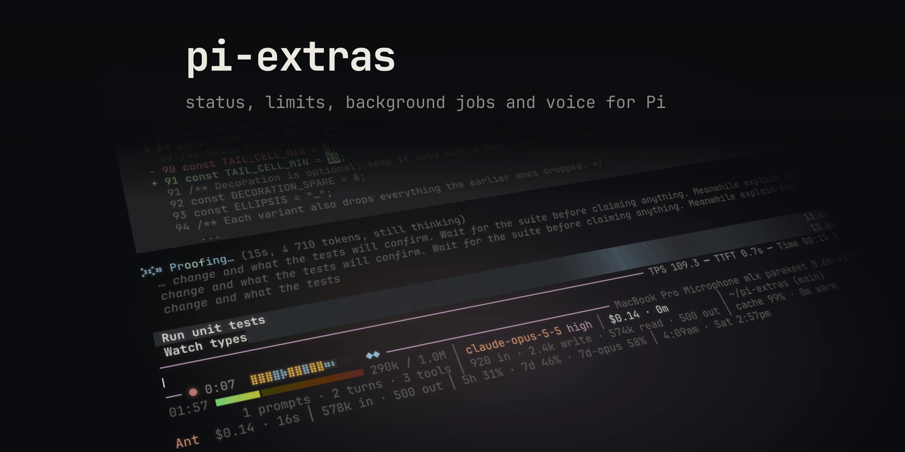

Optional extensions and a theme for [Pi](https://pi.dev): a richer footer,
usage-limit awareness for the agent, activity and timing indicators, background
shell jobs, background subagents on the model of your choice, bounded shell
execution, Kagi subscription search, local voice dictation, and clearer tool
rows.

## Install

Requires Pi **0.99.2 or newer**, Node **22.18 or newer**, npm and Git.
pi-extras follows Pi's latest release; after updating pi-extras, update Pi too.
The shell-job extension currently targets macOS and Linux with a POSIX shell.
Windows process-group behavior has not been validated.

```sh
pi install git:github.com/jaedync/pi-extras
```

Restart Pi after installation. Use `pi config` to select extensions. Installing
adds all sixteen extensions (quota hibernation, computer use and Windows use stay off until you opt in); it makes `quiet` available but does not select it.
Choose the theme using `/settings`. Use only one custom footer at a time.
Phase Spinner wraps an existing editor where possible; other editor extensions
can still conflict.

| Component | Behavior |
| --- | --- |
| Status Plus | Usage/cost grid, context and cache indicators, per-provider limits, optional linked subagent usage |
| Usage Guard | `usage` tool, `/usage` command, one-shot wrap-up warnings for a session budget or, when enabled, near a limit |
| Cache Compaction | Prefix-sharing summaries that reuse the session's warm prompt cache, with safe fallback to Pi's default compaction |
| Rate-limit Recovery | `/rate-limit-recovery`, bounded backoff for short rate limits, opt-in main-session hibernation for provider cooldowns; subagents fail fast on quotas with reset guidance |
| Phase Spinner | Descriptive status with a per-mode spinner in the editor's top divider, with a per-step stopwatch, alongside tokens/sec, time to first token and total elapsed time; live thinking above queued messages and a π end line when a prompt finishes |
| Tab Status | Pi's state in the terminal tab: an iTerm2 status dot and detail, and tab progress in iTerm2, Ghostty, WezTerm and Windows Terminal |
| Shell Jobs | `shell_job_start`, `shell_job`, `/jobs`, bounded logs and completion notifications; jobs are named after their titles |
| Subagents | `subagent` and `message` tools, `/subagents`: background child agents on your scoped models that report back, talk to main and to each other, with a live band per agent |
| Bash Default Timeout | Adds a 120-second timeout only when a bash call omitted one |
| Kagi Search | Adds `kagi_search` without replacing existing search/fetch tools |
| Voice | Hold or tap ctrl+space to dictate into the editor, transcribed on this machine |
| Computer Use | Opt-in, macOS: a `computer_use` tool that operates Mac apps through OpenAI's Computer Use, installed by the ChatGPT app |
| Windows Use | Opt-in, WSL on a Hyper-V host: a `windows_use` tool that operates Windows VMs through Windows-MCP, which it installs in each guest, and through their consoles |
| Tool Display | Every tool row as a colored header band with live progress and a popup with the whole call, other extensions' tools included; chained bash commands broken into steps; every finished row stays visible, ctrl+o expands them all |
| Copy Blocks | Code blocks and quotes in replies drawn on a background of their own with a `copy` label: one click copies the exact text; `/copy-block` does it from the keyboard |
| Release Notes | What changed in pi-extras, shown once in the first new session after an update; `/pi-extras changelog` shows it again |
| Quiet | Low-contrast theme with restrained accent colors |

## Updates and removal

```sh
pi update --extensions
# Or update Pi and packages together:
pi update --all
pi remove git:github.com/jaedync/pi-extras
```

An unpinned Git install follows upstream commits. Pi can detect available package
updates, but this package does not install an automatic updater or background
service. To pin a published tag, append `@v0.1.0` to the Git source once that tag
exists. Pinned installs require an explicit installation of a newer tag.
After an update, restart Pi or use `/reload`; stop active jobs before removing
the package. Removing it does not remove your credentials or change other packages.

## Configuration

- `STATUSLINE_TZ`: optional IANA timezone for footer clock/reset labels; defaults
  to the system timezone.
- `STATUS_PLUS_POLL_LIMITS=0`: disable authenticated quota polling while retaining
  recorded usage and response-header limits. `PI_OFFLINE` also suppresses polling.
- `PI_EXTRAS_USAGE_GUARD=1` or `0`: turn band warnings on or off for one run.
  See below for the persistent setting.
- `PI_CODING_AGENT_DIR/pi-extras.json` (default `~/.pi/agent/pi-extras.json`):
  persistent Usage Guard settings under `usageGuard`, written by
  `/usage warnings on|off`. Keys: `enabled` (default `false`), `bands`
  (default `[90, 95]`), `resumeMarginSeconds` (default `180`), `proximityPct`
  (default `10`), `maxWaitSeconds` (default `18000`, five hours).
- `PI_RATE_LIMIT_RECOVERY=on|off`: override automatic quota waiting for one run.
  `rateLimitRecovery` in `pi-extras.json`: `autoWait` (default `false`),
  `resumeMarginSeconds` (default `10`), `maxWaitSeconds` (default and hard maximum
  `18000`, five hours total per user-started run), `maxRecoveries` (default `3`,
  maximum `10`), `anthropicFirstEventSeconds` (default `45`, `10` to `600`, `0`
  disables the Anthropic stall retry), `transientMaxWaitSeconds` (default `180`,
  `10` to `900`, `0` leaves short rate limits to Pi's own retry). `/rate-limit-recovery on|off` persists the choice; commands
  take precedence for the current session. `PI_RATE_LIMIT_RECOVERY_ROLE=subagent`
  marks external child sessions as detection-only.
- `PI_SUBAGENTS=off`: disable Subagents. `subagents` in `pi-extras.json`, all
  optional: `defaultModel` (a model or short name; default: the session's
  model), `maxConcurrent` (default `4`), `batchMs` (default `2000`),
  `groupWaitMs` (default `60000`), `replyTimeoutMs` (default `600000`) and
  `childToolsExclude` (tool names children never get) and `resumePolicy`
  (`"reload"`, the default, resumes children a `/reload` interrupted;
  `"always"` also allows one automatic attempt after a restart or crash;
  `"notify"` never resumes on its own). The model guide is
  `PI_CODING_AGENT_DIR/subagent-models.md`, plus `.pi/subagent-models.md` in a
  project. See below.
- `PI_BASH_DEFAULT_TIMEOUT`: seconds; `0` or `off` disables the injected timeout.
  Explicit per-call timeouts are preserved.
- `PI_CACHE_RETENTION=long`: use the hour-long cache-warmth window when the
  transcript doesn't say. Anthropic replies report hour-long cache writes and
  Status Plus follows them, so a proxy that always writes them, such as
  Meridian, needs no setting.
- `PHASE_SPINNER_DEBUG=1`: opt-in local timing diagnostics. Leave off normally.
- `PI_VOICE=off`: disable voice dictation. `PI_VOICE_KEY`: a different key
  (default `ctrl+space`). `PI_VOICE_HOME`: where voice keeps its runtime,
  models and settings (default `~/.cache/pi-extras/voice`, or under
  `XDG_CACHE_HOME`).
- `PI_COMPUTER_USE=on`: enable computer use on macOS. Off by default. See below.
- `PI_WINDOWS_USE=on`: enable Windows use in WSL on a Hyper-V host. Off by default. See below.
  `PI_WINDOWS_USE_VMS`: the only VMs it may use, comma-separated (default: all).
- `PI_TOOL_DISPLAY=off`: leave Pi's own tool rows in place. `/tool-display`
  writes its switches under `toolDisplay` in `pi-extras.json`: `enabled`,
  `others` (default `true`), `chains` (default `true`), `motion` (`full` or
  `reduced`), and `thinking` (`tail`, `collapsed` or `full`; default `tail`).
- `phaseSpinner.verbs` in `pi-extras.json`: opt into playful spinner words
  with `"playful"` (the built-in pie and π list), or up to 100 `"Present|Past"`
  pairs such as `["Simmering|Simmered"]`. Without this setting, the status names
  the phase descriptively.
- `PI_COPY_BLOCKS=off`: leave code blocks and quotes in replies as Pi draws them.
- `statusPlus.toolCount` in `pi-extras.json`: `calls` (the default) or `steps`,
  switched by clicking the footer's tool count or with `/tool-display count`.
- `releaseNotes.seen` in `pi-extras.json`: the last pi-extras version whose
  notes were shown.
- `KAGI_TOKEN_FILE`: path to your own subscription session credential. See below.
- `KAGI_TOOL_NAME=web_search`: explicit search-tool replacement. Leave unset to
  keep `kagi_search` and avoid conflicting with another search extension.

See [security and privacy](docs/security.md) before enabling provider-limit polling
or supplying search credentials. Extensions execute with your user permissions.

## Tab Status

Tab Status shows Pi's state in the terminal tab.

- **iTerm2 3.7.0+** gets a colored Session Status dot with a short detail:
  accent while working, warning while a dialog waits for you, dim when idle,
  and red after a failed turn until the next prompt. Working details name the
  current phase or tools. Idle details say `Done`; set
  `tabStatus.detail: "reply"` to show the first 80 characters of the last reply
  instead.
- **Progress** animates the tab while Pi works, pauses during dialogs and
  Rate-limit Recovery waits, turns red after a failed turn, and clears at idle.
  In Windows Terminal, a full yellow ring means Pi is waiting, either for your
  input in a dialog or for a rate-limit wait to finish, and a full red ring
  means the last turn failed.

Background Subagents and Shell Jobs count as working by default, even after
main finishes.

Progress turns on by itself only in terminals known to support it, because
older terminals can show every progress update as a notification:

| Terminal | Automatic from | Notes |
| --- | --- | --- |
| iTerm2 | 3.6.7 | 3.6.6 supports progress but doesn't advertise it; set `progress: true` |
| Ghostty | 1.2.0 | |
| WezTerm | nightly `20250209-182623-44866cc1` | No paused state, so waits stay indeterminate |
| Windows Terminal | 1.6 | Automatic without a version check because it doesn't report its version; older versions ignore it |

Unknown terminals and older versions stay off, except Windows Terminal:
`WT_SESSION` enables progress without a version check. This works in WSL,
where Windows Terminal passes `WT_SESSION`, but not over SSH, which does not
pass it by default. An explicit other `TERM_PROGRAM`, such as `vscode`, wins
over an inherited `WT_SESSION`. iTerm2 is detected from
`TERM_PROGRAM=iTerm.app`, or from `LC_TERMINAL=iTerm2` (which also works over
SSH) when no other terminal sets `TERM_PROGRAM`. Inside tmux or screen, the
version comes from `LC_TERMINAL_VERSION`, never from the multiplexer's own
version. Windows Terminal needs no version hint. If Pi's
`terminal.showTerminalProgress` setting is on, Pi owns
progress instead; Pi's bar is indeterminate only and ignores background work,
pauses and errors.

Inside tmux, add `set -g allow-passthrough all` so hidden panes can update the
tab. Tab Status wraps its sequences for tmux, resends busy status every second
and sends the final idle twice.

Settings in `pi-extras.json`, applied on `/reload`:

```json
{
  "tabStatus": {
    "enabled": true,
    "sessionStatus": "auto",
    "progress": "auto",
    "busyWhileBackground": true,
    "detail": "done"
  }
}
```

`sessionStatus` and `progress` take `"auto"`, `true` to skip the version check,
or `false` to turn them off. Session Status still needs iTerm2. Force progress
only in a terminal you know supports it.

- Only the top-level interactive session writes to the terminal. Print, JSON
  and RPC modes and subagents stay silent.
- Both fields reset on startup and clear on exit.
- Idle waits 1.5 seconds, so short gaps between turns don't set off completion
  alerts.
- A reload keeps the tab as it is until the new runtime knows the background
  counts. Turning Tab Status off and reloading clears only what it set.
- A crash, or uninstalling pi-extras and then reloading, can leave a stale tab
  until another program resets it.

iTerm2 can show these details in its Cockpit and in status-change alerts; see
[security and privacy](docs/security.md#tab-status).

## Cache Compaction

On by default. To compact, Pi normally sends the conversation to the model as
a new summarization prompt. That prompt can't use the provider's prompt cache,
so the whole context is paid for again at full price. Cache Compaction sends
the summary request as the session's next turn instead: the same system
prompt, tools, history, reasoning settings and session ID, with a
summarization instruction added at the end. The provider reads almost all of
it from cache.

Measured on this machine (provider-reported costs, not invoices):

| Context | Model | Pi's compaction | Cache Compaction |
|---|---|---|---|
| ~15k | Claude Sonnet via Meridian | $0.048 | $0.015 |
| ~15k | Codex | $0.019 | $0.0066 |
| ~42k | Claude Sonnet via Meridian | $0.169 | $0.010 |
| ~42k | Codex | $0.055 | $0.0034 |

In live automatic compactions at a 48k window, about 32k of the 33k input
tokens came from cache, on both Claude and Codex. The summaries were
comparable to Pi's own in a two-model comparison. Results vary by provider and
workload.

**When it runs.** For `/compact`, and for Pi's automatic compaction after a
turn or before a new prompt, as long as:

- the cache is probably still warm (see `idleSeconds` below);
- the model, session and branch haven't changed since the last request;
- the summary fits in the context window (see below).

Otherwise Pi's own compaction runs, exactly as it would without this
extension. The notice after each compaction says which one ran and why.

**Room for the summary.** The summary is written inside the same context
window as the conversation, so it needs room. The extension asks for room for
the previous summary plus 8,000 tokens (6,000 for new material, 2,000 for
reasoning), and keeps a safety margin of 4,096 tokens plus 60% of whatever was
added since the last request, because that part is only estimated.

At Pi's default `compaction.reserveTokens` of 16,384, an automatic compaction
has about 12k tokens of room before anything added since the last request.
First summaries fit. Later summaries in long sessions often don't, because
each one carries the previous summary forward. Out of 183 compactions in local
sessions, 58% would have had room at the default, and all of them at 32,768 or
49,152. (Method: the model-written part of each saved summary, at four
characters per token, against room for the previous summary plus 8,000.) On
large-window models, raise the reserve in Pi's `settings.json`; 32k is about
3% of a 1M-token window:

```json
{ "compaction": { "reserveTokens": 32768 } }
```

**Settings.** In `PI_CODING_AGENT_DIR/pi-extras.json` (default
`~/.pi/agent/pi-extras.json`), then `/reload`:

```json
{
  "cacheCompaction": {
    "enabled": true,
    "idleSeconds": { "anthropic": 3300, "openai-codex": 240 }
  }
}
```

- `enabled`: `false` leaves Pi's compaction untouched.
- `idleSeconds`: per provider, how long after the last request the cache
  counts as warm, from 0 to 86400 (0 means never use the cache path). The
  default is 55 minutes for Anthropic through Meridian on port 3456, which
  writes one-hour caches, and 4 minutes for everything else. The example's
  `anthropic` value also applies to Anthropic's own API, which keeps caches
  for 5 minutes, so leave it out unless every Anthropic route you use keeps
  long caches.

**Providers.** Anthropic Messages, OpenAI Responses (including Codex and
Azure), Google Generative AI and Vertex. Other APIs use Pi's compaction.
Tested with Pi 0.99.2. If another extension changes requests in
`context_with_system`, `before_provider_headers` or `before_provider_request`,
load it before this one.

**Also falls back when:** Pi is recovering from a context overflow; the place
where Pi's kept messages begin can't be identified unambiguously; Pi is
blocking images in the session; or the reply is an error, empty, a tool call,
or cut off at the output limit. Codex requests don't declare an output limit,
so for Codex the room check is the extension's own guard rather than a limit
the provider enforces.

**Cost of a failed attempt.** If the cached request fails, the provider still
bills it, but it isn't counted in the session's totals. Pi's compaction then
runs as usual. See [security and privacy](docs/security.md#cache-compaction)
for what is kept in memory.

## Usage Guard

Usage Guard reads the limit snapshots Status Plus polls; it never fetches on its
own except when the `usage` tool is called with `refresh: true`. Only windows that
govern the active model count: provider-wide windows always, model-specific ones
(such as an Anthropic `seven_day_fable` bucket) only when the active model id
carries that family. Balances (Enterprise spend, prepaid credits) and per-minute
rate limits taken from response headers are reported but never warned on.

- `usage` tool: percent used, thresholds, reset time, seconds until reset and
  `resumeAfterSeconds` (reset plus margin) per window, and `waitable` when the
  reset is exact and within `maxWaitSeconds`. `setBudget` records a
  session budget ("work until 60% of the weekly limit"); `all` includes other
  providers and non-governing windows.
- Warnings are off by default: only a session budget warns, once, when its
  window is reached. `/usage warnings on` adds band warnings (90 and 95 by
  default) and provider blocks. Each fires once per window, threshold and reset
  cycle, immediately before a model request, as a message appended to context
  without changing the system prompt or initiating another request. Idle polls
  do not queue warnings for later delivery: the active provider and model family
  are checked again for manual prompts, automated wakeups and queued follow-ups. Obsolete automatic warnings remain in raw history
  but are omitted from requests for models they do not govern, and from every
  request once their window has reset. Resets reported
  within ten minutes of each other
  count as one cycle, since proxies recompute them on every fetch. The first
  band is advance notice only. The final message never cuts short work that
  fits: for a waitable reset (any window, weekly included, within
  `maxWaitSeconds` of its reset) it tells the agent to finish what fits, then
  sleep through the reset in a background job (`sleep resumeAfterSeconds`)
  and carry on, so the run outlasts the limit instead of halting. A reset
  days away or a session budget asks for a clean checkpoint and a summary. A
  model-scoped window notes that other models are unaffected. Fired keys and the budget persist with the
  session, so a resumed session does not repeat them.
- `/usage` queues the current snapshot for the next turn; `/usage budget 7d 60`
  and `/usage budget clear` manage the session budget; `/usage warnings on|off`
  persists the toggle.
- Polling: providers whose window sits within `proximityPct` of a threshold poll
  at their faster cadence; failed polls back off exponentially up to ten minutes.

## Rate-limit Recovery

Usage Guard helps the agent checkpoint before a quota runs out. Rate-limit
Recovery handles the actual rejection without asking an unavailable model to
schedule a sleep. Detection is always on; `/rate-limit-recovery on` opts an
interactive main session into automatic waiting. `/rate-limit-recovery status`
shows the policy, `off` disables it, and `cancel` stops an active wait.

A structured `rate_limit_error` or `rate_limit_exceeded` with a numeric
`retry_after` in seconds supplies the reset estimate. The extension waits that
remaining delay plus its safety margin, shows a countdown, then makes one
continuation. Escape or Ctrl+C cancels; outside a wait, Pi keeps its usual key
behavior. Switching between Anthropic models, including compatible aliases,
retains the cooldown and uses the newly selected model on resume. Switching
outside that scope cancels. Other providers retain waits across models on the
same provider.

Before the retried request, a persisted message records the actual elapsed
wall time and UTC pause/resume timestamps, plus the limited and current models.
If the system clock moves backward, the notice labels a lower bound from the
completed timer instead of claiming an exact wall-clock duration. Steering
queued while waiting reaches the recovery request; explicitly deferred
follow-ups remain deferred until the original task finishes, as in Pi.
It is a timing notice, not proof that quota has reset. Each user-started run
has a shared five-hour maximum wait budget (margins included) and at most three
recoveries by default. Excessive delays are refused, never shortened to retry
early. Reload, session replacement and exit cancel; a restarted session never
silently resumes a previous wait.

Anthropic subscription requests (OAuth, direct to `api.anthropic.com`) can be
held near :00 and :30 UTC: the response starts, then sends only keep-alive
pings for minutes, and Pi never retries because pings count as activity. If no
real event follows the headers within `anthropicFirstEventSeconds` (45 s), the
request fails as a timeout and Pi's normal auto-retry sends it again. API-key
requests, proxies such as a local gateway, and other providers are untouched.

Short rate limits get their own backoff, on by default in every session,
subagents included: OpenRouter's "temporarily rate-limited upstream" and other
429 or rate-limit errors without a structured reset. Pi's own retry gives up
after about 14 seconds, while these usually clear within a minute. The extension
waits 5, 10, 20, 40, then 60 seconds (each ±20% so parallel subagents spread
out, and never less than the 429's `Retry-After`), for up to
`transientMaxWaitSeconds` (180 s) per streak, then sends the request again. A
countdown shows in interactive sessions; Esc cancels, and switching models
resumes at once with the new model. If the limit outlasts the budget, the run
ends with guidance. Quota, billing and usage-limit errors are not treated as
short limits. A limit reported inside an already started stream is recognized
only by its message text, because Pi keeps no status code or structured reset
for it: OpenRouter's "rate-limited upstream" wording gets this backoff, while a
generic message such as "Provider returned error" stays with Pi's own retry.

Recognized quota errors remain errors and are classified as non-transient so
Pi does not run a competing short retry loop. This recovery policy is independent
of Pi's `retry.enabled`; ordinary transient failures retain Pi's native retries.
For native Anthropic and OpenAI HTTP adapters (including Azure and Codex), a
request-local guard also stops configured transport retries on recognized JSON
429 errors. It preserves endpoint, authentication and model configuration;
ordinary HTTP failures keep both transport and session retry behavior. Inspection
is bounded to 32 KiB and 500 ms. A legacy custom provider's guard stays on one
API; switching that provider to another API preserves its custom routing and
adapter retries rather than retargeting it. Built-in providers with several APIs
(OpenRouter, Copilot) move their guard to the selected API at the next request,
unless a subagent shares it. Unsupported transports, mixed-API
legacy requests and unrecognized formats retain adapter behavior; detection
runs when Pi reports the final error. Header-only reset timing is not guessed.
If waiting is off, timing is missing, or the budget is exhausted, the session
fails with reset guidance instead. Provider reset times are estimates.

**Children never hibernate.** The pi-extras child launcher installs an explicit
quota guard that never sleeps, even when the parent has opted in: one quota rejection
fails the child, frees its slot, and tells the parent the provider, expected
reset time and time remaining. Hidden transport retries are suppressed on the
guarded native HTTP paths described above; custom or unsupported adapter retries
remain owned by those adapters. Print, JSON and RPC sessions likewise never
auto-wait, so external noninteractive children cannot inherit a long sleep.
The bounded short-limit backoff above still applies to them.
External launchers that disable extensions must explicitly load detection;
this package cannot intercept requests made outside Pi's extension runtime.
The extension makes no quota polls of its own and pauses cache warming for
the limited model scope until the estimated reset.

## Voice

Hold ctrl+space and speak, or tap it to start and tap again to stop. Esc
discards the recording, including after you stop while it is still being
transcribed. The transcript is typed into the editor and never sent
on its own; review it and press Enter yourself. Speech is transcribed in
chunks at each pause while you talk, so when you stop only the last chunk is
left to decode and the text starts typing in right away.

A recording row in the editor border shows a red dot, the elapsed time, a level
meter, one mark per chunk, the microphone and the model. It uses the top border
when that is free and the bottom border while the agent is working. Warnings
there cover a mic that hears nothing, audio that clips, and a missing
permission. After you stop, a wait longer than a second says what it is
waiting for (starting voice, loading the speech model, or transcribing).

`/voice` opens a menu with the current mic and model. `/voice mic` picks the
input device (saved by name; a missing device falls back to the system default
with a one-time warning). `/voice model` picks the speech model, `/voice status`
shows what is installed and why a model was skipped, `/voice setup` retries
installation, and `/voice unload` frees the model's memory.

**Platforms.** macOS, and Linux with PulseAudio or ALSA (including WSLg).
Linux has had less testing than macOS. Windows is not supported. Hosts without
an audio input never download anything.

**First run.** On a machine with a microphone, the first Pi session installs
voice in the background: a private [uv](https://github.com/astral-sh/uv),
Python 3.12, the `sherpa-onnx` speech runtime, and NVIDIA Parakeet models. The
108 MB English model comes first; on machines with 8 GB of RAM or more the
487 MB multilingual Parakeet v3 follows and becomes the default. On Apple
Silicon, `/voice model` also offers an MLX build of Parakeet v3 (about 2.5 GB).
A model is skipped when the disk has less than twice its size free. Setup
never blocks Pi; a dictation started before it finishes waits for it.

**Background process.** One daemon per user holds the model and serves every
Pi session. It starts on the first dictation, exits 15 minutes after the last
one, and exits sooner once no Pi session is open. The next dictation starts it
again and loses no audio while it loads.

**macOS over SSH.** macOS gives SSH sessions a silent microphone, so when Pi
runs over SSH, recording runs as a short-lived launchd job in your desktop
session instead. macOS asks once, on the Mac's screen, to allow
`ffmpeg` to use the microphone; this needs Homebrew `ffmpeg`. About the first
half second of each recording is lost while that job starts.

## Phase Spinner

The editor's top divider says what the agent is doing:

```text
─ ⢌⡱⢎ Thinking… 00:12.4 ↓ 212 tokens ──── TPS 109.3 ─ TTFT 0.7s ─ Time 00:15.8 ─
```

- **The word** names the phase: `Sending request`, `Waiting for the model`,
  `Thinking` (then `Still thinking`, `Thinking more` and `Deep in thought`),
  `Writing bash call`, `Running bash` or `Running 3 tools`, and
  `Writing reply`. A token count follows it while the model writes. Pi's own
  statuses (compacting, retrying, summarizing a branch) take its place while
  they run.
- **The spinner** is three cells wide, so the word never moves. Each kind of
  work has its own: a ping while the request goes out, a helix while the model
  thinks, a print head while it writes a tool call, a comet orbit while tools
  run, two comets while it waits for a subagent's reply, and a wave that
  follows the stream's speed while it writes the reply. Compaction squeezes to
  a point, a retry drains, and a branch summary walks every row.
- **Color:** the status turns amber after 10 seconds of thinking, and red when
  no tokens have come for 10 seconds.
- **The clocks:** a per-step stopwatch sits beside the word, in tenths, and
  shares its amber/red tone. It restarts for a new request, thinking, reply,
  tool call or running-tool step; later thinking wordings keep the same clock.
  Pi's statuses get their own clock, except retries that already show a countdown.
  Standalone idle statuses show only this clock, without a duplicate total.
  Reduced motion holds the spinner still but keeps these clocks ticking.
- **The right side** keeps TPS, time to first token and total `Time`.
  Narrow terminals drop TPS first, then TTFT, then tokens, then total `Time`
  and its hidden-line count. Long tool names and playful details retire before
  the step clock; the word, spinner and step clock go last. The status never wraps.

While the model thinks, its newest three lines show dimly at the bottom of the
conversation, above queued messages. A tool call the model is still writing
shows as Pi's own row in the conversation.

When a prompt finishes, a dotted π waves in and out in the divider, and the
conversation keeps an end line such as `π Worked for 41s, done 9:14 PM`, or
`π Stopped after 12s` when you stopped it. The end line and the thinking rows
are only drawn; the model never sees them.

Set `phaseSpinner.verbs` to `"playful"` for pie and π words (Proofing,
Kneading, Approximating, …), or to your own `"Present|Past"` pairs. One verb
then lasts the whole prompt, the phase follows it, and the end line uses its
past tense.

Voice recording uses the bottom border while the agent works, so the status
stays visible. Pi's own working loader stays hidden.
`/tool-display motion reduced` holds every spinner on a still frame.

The π, `●`, `∴` and timeout marks are drawn one cell wide. A terminal set to
draw East Asian ambiguous-width characters two cells wide will misalign them.

## Tool Display

Tool Display redraws tool rows in the terminal: Pi's built-in tools, and
every other tool too (see below). The tools are built as usual, and the model
sees the same tools, descriptions and results; only the rows change.

Each call is one header band: the tool and its target on the left, the time on
the right. The band's color says how it went (green done, red failed, amber
timed out, gray aborted), so there are no status marks, and a failure is named
in words in the right rail (`exit 1`, `timed out`). While a call runs, the band
fills toward its timeout and warms as the timeout gets close; a call without a
timeout sweeps instead. Rows share the bullet column with the agent's text.
While a call runs, its bullet says what kind of call it is: a shell command
with a timeout fills `○ ◔ ◑ ◕ ●` as it uses up its timeout, a subagent or peer
request has a slowly circling dot, a web call breathes, and other calls keep a
still dot. A call being written or waiting its turn shows a dim dot. Times of ten
seconds or more are drawn in a warmer color, so slow calls stand out when you
scroll back. Output sits indented under
the band on a gray panel, so each call reads as one block apart from the
conversation.

- **bash**: the command, and its last few lines of output.
- **read**: what was read, e.g. `80 lines` or `20 of 5,321 lines`.
- **edit**: `+12 −3`, with long diffs collapsed.
- **write**: the file's line count, and its last three lines (where a
  streaming write is).
- **grep, find, ls**: what was found (`23 matches in 7 files`, `42 files`).

Every tool row stays visible after it finishes. Pi's native ctrl+o expands
all rows, as before.

Output that doesn't fit ends in a line such as `… 12 earlier lines`; a single
hidden line is shown instead, since the hint would take its place anyway.
Click a row to open the whole call over the full terminal: the full command,
every line of output, and for a chained command each step (pick one with a
click, its number, tab or the arrow keys). `copy command` and `copy output` in
its title bar, or `c` and `o`, copy them whole; text dragged across copies
what it shows. Esc, `q` or `✕` closes it. ctrl+o still expands every row in
place.

**Agent communication.** Mesh `agent_send` and `agent_request` rows use purple
bands, like subagent mail. Delivery failures keep their red rail words rather
than recoloring the band. `list_peers` keeps the usual operational colors.
Incoming remote-pi mesh messages show the sender's name and working-directory
basename, `→ me`, and `message` or `replies`, over a purple Markdown preview.
Click or ctrl+o expands the body. Transport headers and reply instructions stay
in model context but are hidden from the human view; unfamiliar envelopes fall
back to a purple band over their raw text. Tool Display registers this renderer,
so it works even when Subagents is disabled.

**Other tools.** Every other tool's rows get the same band, with the time and
any failure in the right rail. pi-extras's own tools have layouts of their own:

- **web_search, kagi_search**: the query and how many results came back, with
  the first three under it.
- **computer_use**, **windows_use**: the apps (or VMs) the script used and how
  many calls and screenshots it took, with the last calls under it. A failed
  call says `failed` or `not allowed` in words.
- **usage**: each window's use in the band itself, amber from 80% and red when
  a limit is spent.
- **codemode**: a JavaScript band with numbered `ƒ` tool-call cells, distinct
  from shell steps. While arguments stream, a bounded preview shows the newest
  four JavaScript source lines, or “Writing JavaScript…” until source arrives.
  It does not label draft calls as queued or executing. Live statuses and elapsed
  times come from Pi's nested-call events, never guesses about JavaScript statements. `overlap` means call
  lifetimes overlap, including queue and permission waits; it does not claim
  parallel execution. The collapsed row keeps the newest four calls. Expand
  or click for the full script, individual call output and script result.
  The popup keeps Source and Result views fixed and follows selected call IDs
  as calls arrive. The whole script scrolls in the body. Copy Script preserves
  ordinary source text but removes unsafe terminal controls, without changing
  execution; Copy Preview copies only retained call output. Missing or omitted
  previews cannot be copied.
  Truncating live output previews does not mark call history incomplete.
  Restored calls use Pi's saved metadata and say when nested output was not
  saved. Older/foreign implementations without call metadata retain their own
  result renderer. `/tool-display others off` leaves codemode's original row;
  `chains off` affects bash only. Script and tool behavior are unchanged.

Other extensions' tools, such as MCP, subagent and web access tools, keep their
own words: the band shows the line the tool would draw for its call, and under
it sit the first four lines of the tool's own result. A tool with nothing of
its own to say shows its most telling argument and the result's text. The
popup lists every argument and the whole result. Rows that already draw a band
of their own, such as Shell Jobs, are left as they are.

Drawing other tools' rows relies on how Pi builds a tool row, which is not part
of Pi's extension API. If a Pi update changes it, those rows are drawn by
their own tools again; Pi's built-in tools keep the band either way.

**Thinking.** While the model thinks, its newest three lines show above queued
messages and the editor divider. Paragraphs and list items are joined with `·`
rather than taking lines of their own, so the three lines hold as much as fits. When thinking
ends, the transcript keeps one `∴ Thought for 12s` row. Click it to read the
whole block, and again to go back; ctrl+t does the same for every block.
`/tool-display thinking collapsed` shows just the label, as Pi does, and
`/tool-display thinking full` shows everything.

**Compaction.** A purple header band shows the reason (`auto`, `manual` or
`overflow`), tokens before and estimated tokens after (`~`), cost when known,
and elapsed time. The first three summary lines sit under it on Pi's
compaction purple. Click the row or use ctrl+o to read the full Markdown summary.
Timing and sizes survive a session resume; older compactions show only their
before size. Pi's separate billing notice remains when enabled.

**Chained commands.** A bash command joined with `&&`, `||` or `;` is shown as
its steps, each with its own status and time, so you can see which one failed
and which never ran. The running step's line breathes gently, and each step
that finishes flashes green (or red, or amber) and fades back, so a run of
quick steps reads as a wave down the list. A leading `cd` becomes the
location instead of a step.
To time each step, Tool Display adds a marker line around each step before the
command runs and removes the markers from the output before Pi or the model
sees it. The model's command and the output it reads are unchanged. Commands
Tool Display can't split safely (heredocs, `if` and `for` blocks, background
`&`, `exit` or `set`) run exactly as written. See
[security and privacy](docs/security.md#tool-display) for what the rewrite does.

`/tool-display` switches it:

- `/tool-display on|off`: Tool Display's rows, or each tool's own.
- `/tool-display others on|off`: draw other extensions' tool rows with the
  band, or leave them to their own renderers.
- `/tool-display chains on|off`: break chained commands into steps, or run
  them as written.
- `/tool-display motion full|reduced`: the reduced setting drops the sweep,
  the running step's breathing and the finish flashes, holds spinners on a
  still frame, and updates times once a second.
- `/tool-display thinking tail|collapsed|full`: how thinking blocks rest.
- `/tool-display count calls|steps`: how Status Plus counts tools (see below).

The choices are saved in `pi-extras.json`. Rows change only in the terminal UI;
print, JSON and RPC runs keep Pi's tools untouched. If another extension
already replaces one of Pi's built-in tools, Tool Display leaves that tool's
definition alone and draws its rows as it does any other extension's.

**Tool count.** Status Plus counts one tool per call that ran; calls in a
failed or aborted reply never run and are left out. Click the
count in the footer to count each step of a chained command instead; the
count brightens to show it, and the choice is saved. Where the terminal sends
no clicks to the footer, `/tool-display count steps` does the same.

**Shell Jobs** use the same bands. A job is named after its title
(`Run unit tests` becomes `run-unit-tests`), and the model is asked to call it
by its title when talking to you. Starting a job leaves a small chip in the
transcript rather than a full-width row, `↳ Run unit tests  in background`,
so handing work off reads apart from calls that ran in place. The chip stays
still; the job's band above the editor is the one that moves. When the job
ends the chip takes its outcome (green `done`, red `exit 2`, gray `stopped`)
and time, and its completion is one band with how it ended and how long it
took; click it for the output. Click a running job's row
or its band above the editor to open its live log over the full terminal,
with buttons (or `c` and `o`) to copy the command and the whole log; Esc, `q`
or `✕` closes it.

## Copy Blocks

Code blocks and quotes in the agent's replies are drawn as cards on a
background of their own. A code block's header shows its language and a
`copy` label; a quote's label sits at the right of a line near its top that
has room, or on a row of its own. Click a code block's header, or a quote's
label, and the block's exact text goes to the clipboard: the code as written,
tabs included, and a quote without its `>` markers or the line breaks
wrapping added. The label reads `✓ copied` for a moment after. A card ten
rows or taller has a label at its foot too (a quote's last line, or a row
under it), so one is in view from whichever end you scrolled to.

Clicks need Pi's fullscreen mode (`"tuiMode": "fullscreen"`); in the regular
mode the terminal owns the mouse, so the cards keep their background and
leave the labels out. `/copy-block` works in both: it copies the last code
block or quote of the latest reply, and `/copy-block 2` the second.

Drawing the cards relies on how Pi builds an assistant message, which is not
part of Pi's extension API. If a Pi update changes it, replies are drawn as
Pi draws them and `/copy-block` still works.

## Subagents

The `subagent` tool starts a child agent: a separate Pi session on the model
the agent picks, with a fresh context, the same working directory and the
same tools minus a few that make no sense in a child (mesh, goals, desktop
control, background jobs). Only the extensions that provide those tools load
in the child, so the rest, such as the remote-pi mesh, keep serving the parent
session. It runs in the background and its report arrives
as a message, so the agent keeps working or ends its turn and is woken when it
matters. `wait: true` blocks instead, for a quick check. `readOnly: true` takes
away `bash`, `edit` and `write`. `context: "fork"` gives the child a condensed
copy of the conversation so far.

**Models.** A child may run on any of the session's scoped models
(`enabledModels`, the list `/scoped-models` shows); short names such as `luna`
or `opus` work when they match one. Its thinking level is the call's, else the
one Pi's `modelThinkingLevels` sets for that model, else your default. Which
model suits what is yours to say in a Markdown guide,
`~/.pi/agent/subagent-models.md`:

```md
- luna: extreme cost savings; bulk search, summaries, mechanical edits
- gpt-6.1 sol: reliable worker for implementation
- opus 5.5: taste; design, naming, reviewing plans
```

It goes into the tool's description with the model list. Pi reads it when a
session starts and on `/reload`, never mid-session, since a changed tool
description busts the prompt cache. `/subagents guide` edits it, or ask the
agent to.

**Talking.** Every agent has a name made from its task, and `main` is the
session. `message` sends a note to an agent by name, or to `all`. A running
agent reads it after its current tool call; a finished one resumes with its
context to handle it. A child can ask with `expectReply: true` and wait for the
answer. Main never waits: a child's note or question wakes it, and so does the
answer to anything main asked. When main's question resumes a finished child that
answers and then just writes its final text, the report doesn't wake main a
second time. More work, new input or a failure after the answer does, so a
report is never silently missed. Children know each other and can split work
directly.
Messages to main show above the editor until they are in the transcript.
What you type to a child directly is recorded for main without waking it.
Reports from children started in the same run arrive together, as one message.
`message` call rows and incoming notes, questions, replies and relays all use
purple bands. A question keeps its amber `asks` word; failed deliveries keep
red words. Incoming mail has a purple Markdown preview, expandable by click
or ctrl+o. Reports keep their green or red outcome colors.

**Seeing it.** A backgrounded start leaves a compact, still chip like Shell
Jobs: `↳ reviewer  opus high  in background`. It takes the final outcome and
time when the child ends. A blocking `wait: true` call retains its full band
and activity line; expanding a background call shows its task in full. A
report's band shows the run's cost, tokens (`in` counts cached prompt tokens
too) and time. When its answer is already on screen, the report stays one band
and a click unfolds its text.
Each agent has a band above the editor: its model and thinking
level, what it is doing right now, how full its context is (`ctx 12%`), what
it has cost and how long this run has taken. Children of children sit under
their parent. A child the agent waits on shows in its `subagent` row instead,
with what it is doing on the line under it. Click a
band, a `subagent` row, or run `/subagents` to open the inspector over the full
terminal: the agent's task and live transcript, with a message box. Type and
press Enter to write to it (steered in while it runs, resuming it when it has
finished, answering it when it asked); ctrl+x twice stops it, Esc or `✕`
closes, and its title bar copies the task or the report. Main is told what you
wrote. Status Plus counts every child in its totals.

**Reports.** Each finished run that has a final report saves it in full beside
its session as `<session base>.run-<n>.report.md`, including failed and stopped
runs. The completion message gives that path and a preview of up to 12,000
characters; main reads the rest with its normal read tool. `/subagents report
<name>` shows the latest report's path. Each run keeps its own file, and run
numbers can skip when a run ends waiting for a reply. If saving fails, the
message still arrives and points to the session file as before.

**Limits.** At most `maxConcurrent` children run at once; the rest queue. A
child can't start children of its own by default.

**Restoration.** Children survive `/reload`, restarts and crashes. An
`index.json` beside their sessions keeps each child's name, settings, state and
run count, so `message` reaches them again after a restart. Children that a
`/reload` interrupted resume on their own, once. After a restart or crash they
come back paused, and main gets one notice listing them with their task and
last activity. `/subagents resume <name>` continues a paused child; message
finished ones instead. A resumed child is told to check files first, because
its last tool call may not have finished.

Some children never resume on their own: ones paused earlier, grandchildren,
sessions from before 0.15.0, orphans (child sessions missing from the index,
listed in `/subagents` and restored read-only), children whose workspace moved,
and children whose model is no longer allowed (resuming one of those by hand
uses the current default model and says so). An automatic resume that is
itself interrupted stays paused, and a failed resume can be retried. Only one
Pi process at a time can own a session's children; forks start without them.

Each run adds a line to `~/.pi/agent/subagents/runs.jsonl` (model,
task opening, time, tool calls, cost, how it ended); `/subagents stats` sums it
by model, which is what to tune the guide on. `/subagents stop <name>` or
`stop all` stops children, including paused interrupted ones.

If another extension already has a `subagent` tool, such as pi-subagents,
Subagents stays off for the session and says so; remove one of the two. A
`message` tool from another extension is left alone and only that tool is
skipped.

## Computer use

Opt-in and macOS only: set `PI_COMPUTER_USE=on` before starting Pi. It adds a
`computer_use` tool that runs a short script against OpenAI's Computer Use
methods (`sky.list_apps`, `sky.get_app_state`, `sky.click`, `sky.type_text` and
the rest), so the agent can read an app's accessibility tree and screenshot and
act on it. It needs the ChatGPT app for macOS with Computer Use turned on, which
installs the signed Computer Use client under `~/.codex/computer-use`, and
someone logged in to the Mac's desktop. `/computer-use` shows what is missing.

The first use of each app asks you to allow it. "Don't allow" is the default,
so a stray Enter refuses. "Allow for this session" lasts until the client exits;
"Always allow" is stored by the Computer Use service and also applies to ChatGPT
and Codex computer use. Apps the service rates high risk, such as browsers, show
its prompt injection warning. The service never allows some apps, such as
terminals. Without a UI, such as `pi -p` or a subagent, an app that is not
always allowed is denied unless Allow all is on, and the agent is told how to
allow it.

`/computer-use` opens a panel with the client's status, the apps mode and a
checklist of the apps the agent may always use. Check and uncheck any number of
apps, type to filter, and press Enter to save them together; always allowing an
app or turning on Allow all asks you to confirm first. Checking an app ahead of
time lets headless runs use it. Changes apply immediately, including to a
running client. The checklist edits the same approvals file as the ChatGPT
app's settings; if that file ever has a format this version does not know, it
is shown read-only.

The apps mode sits on top of the checklist, applies to every Pi session, and
is kept in `~/.pi/agent/pi-extras.json`:

- Ask per app (default): checked apps are used without asking; any other app
  asks you first.
- Allow all: every app is allowed without asking, including high-risk apps
  such as browsers and mail, and also without a UI. These approvals last only
  for the client session and are never stored, so the checklist is unchanged
  when you switch back. The service still refuses some apps, such as terminals.
- Allow none: every computer use call is refused, even for checked apps.

Each tool call shows the script as highlighted code, then every Computer Use
call it made, with its app and target, how long it took, and any approval.
The client stays running between calls, so element indices stay valid across
turns, and exits after five idle minutes. It runs as a launchd job in your
desktop session, so it works the same from a local terminal and over SSH. Use
only one `computer_use` provider at a time; remove another computer-use
extension before opting in.

This relies on undocumented parts of the ChatGPT app and can break when it
updates. OpenAI does not produce or endorse this integration.

## Windows use

Opt-in, for Pi running in WSL on a Windows Hyper-V host: set
`PI_WINDOWS_USE=on` before starting Pi. It adds a `windows_use` tool that runs a
short script against the host's Windows VMs, the way `computer_use` runs one
against Mac apps. Guest methods (`win.snapshot`, `win.click`, `win.type`,
`win.key`, `win.app`, `win.powershell` and the rest) go to
[Windows-MCP](https://github.com/CursorTouch/Windows-MCP) inside the VM, which
reads the UI Automation tree and acts in the signed-in desktop. `win.console.*`
methods drive the VM's screen, keyboard and mouse from the host through
Hyper-V in a confirmed console session, including its lock and UAC screens.
In an enhanced VM Connect/RDP session, guest methods operate in that same
session, console input is refused, and console screenshot/OCR methods read
Windows-MCP's image instead. Every method names its
VM: `win.snapshot({ vm: "Win11" })`; `win.vms()` lists them. To keep a session
away from some VMs, set `PI_WINDOWS_USE_VMS` to the ones it may use, such as
`PI_WINDOWS_USE_VMS="Win11,Test Lab"` (names match case-insensitively). Other
VMs are then left out of `win.vms()`, and a call naming one fails before
anything reaches the host.

On a visible basic-session desktop, the first call installs Windows-MCP
through the console. An enhanced session needs Windows-MCP already installed
and reachable; a sign-in screen alone is not evidence that console sign-in is
safe. Setup opens an elevated PowerShell from the Run box,
accepts the UAC prompt, reads the console with OCR until that PowerShell is
ready (so the bootstrap, which carries the key, is never typed into another
window), and types a short bootstrap that installs
[uv](https://docs.astral.sh/uv/) and Windows-MCP (0.8.6 or a later 0.8
release, whose output windows_use is built to read) for the signed-in user,
starts it at every logon, opens its port to the local subnet only, and
requires a random key held on the host, new for every install. Setup disables
PSReadLine only in its temporary shell to avoid expensive long-line redraws.
The host key changes atomically after the entire command is queued, so a
partial-typing failure leaves the existing server's authentication usable.
Console input uses a paired Hyper-V `TypeKey` stroke per character with settled,
grouped modifiers to preserve case and punctuation without a separate CIM call
for every make and break.
When the VM's Hyper-V key-value exchange works (it's on by default), the
bootstrap itself goes over it and only a short stub is typed. The stub carries
the key and the bootstrap's hash, and a whole setup took about three minutes
live. Otherwise all of it is typed, which took about seven minutes, within a
10-minute input budget. Installation needs internet access in the guest. The
exception is a reinstall that can't reach the package index: it keeps an
installed Windows-MCP from the same release line. An install that fails
stops at once with the guest's error, which the bootstrap reports to the host
through Hyper-V key-value exchange. After that, each call first makes sure the VM
is usable and repairs what it can, and the result says what it did:

- The server reports its live Windows session and connection state before
  guest tools run. A locked, disconnected or transitioning remote session
  needs the user to reconnect or unlock the same VM Connect window.
- A locked console session is signed back in only after a fresh session check.
  After a reboot, the tool waits for the logon task. If the server remains
  unavailable at sign-in, it asks for help instead of taking the console.
- A stopped server may be reinstalled when a console desktop is visible.
  A remembered enhanced session blocks this fallback even if it goes offline.
- An unresponsive server may be restarted from a confirmed console's Run box,
  read with OCR first. In an enhanced session, it reports the failure without
  sending console input.
- A snapshot stalled by Start or its search, which sometimes stop answering UI
  Automation, gets them restarted (Windows starts them again when opened) and
  is taken again. A snapshot stalled by another app's window fails after 30
  seconds and names that window.
- A VM that is starting, restarting or installing updates is waited for, up
  to 15 minutes, before anything is clicked. It shows as a nearly black screen
  or a missing Hyper-V heartbeat.
- A VM that is off or saved is left alone; `win.start({ vm })` starts it.

Windows-MCP runs with the signed-in user's rights, not an administrator's, so
it can't read or send input to the windows of apps that run as administrator:
their UI tree is empty, and its clicks and keys to them are dropped without an
error. Snapshots mark such windows. Console input can reach them only in a
confirmed basic session; an enhanced session cannot use that fallback.

To give Windows-MCP administrator rights, set `PI_WINDOWS_USE_ELEVATED=on`.
Setup then has the logon task run it with the guest user's full
administrator rights (the task's highest run level, which needs that user to
be an administrator), and a server set up the other way is reinstalled on
the next call at the console; turning the setting off reinstalls it without
them. In an enhanced session a mismatch is reported, not repaired through the
console. Match the setting to the existing server or arrange a repair without
moving the desktop.
`win.powershell` and the apps `win.app` launches then run as administrator,
without UAC prompts, and Windows-MCP's clicks and keys reach apps running as
administrator. Their UI trees fared poorly in testing even so: a snapshot
crashed Event Viewer whenever it showed an event log, Services stalled
snapshots past their limit, and a vendor's MMC console kept its tree hidden. The
tool description steers agents to PowerShell (`Get-WinEvent`,
`Get-Service`) and OCR for such consoles. See
[security and privacy](docs/security.md#windows-use) for what the setting
allows.

`win.console.ocr({ vm })` reads the screen's text with Windows OCR on the
host, as lines of `(x,y) text` whose centers can be clicked. It covers what
the UI tree can't describe, such as custom-drawn windows, MMC consoles, UAC
and sign-in screens at the console, and needs no model that takes images.
In enhanced sessions it reads the guest screenshot and converts OCR points
back to desktop pixels, accounting for image downscaling and monitor offsets.
Region filters use those same desktop pixels. `win.console.screenshot` reports
the image dimensions plus the enhanced image's `source`, session, `x`/`y`
origin, `screenWidth`/`screenHeight` and `scaleX`/`scaleY`; screen coordinates
are origin plus image coordinates times scale. Failed remote captures never
fall back to the unrelated console. Only a freshly confirmed console display
may be woken with Shift; an unknown console screenshot stays read-only.

An app that asks for administrator rights raises a UAC prompt on the secure
desktop, where Windows-MCP can't see: a snapshot then fails and says a prompt
is up. At a freshly confirmed console, `win.uac({ vm, answer: "yes" })` (or
`"no"`) answers it. In an enhanced session the user must answer in VM Connect;
console keys cannot reach that session's secure desktop. A prompt that asks
for a password stays up; it is never typed. A synchronous PowerShell
`Start-Process -Verb RunAs` can wait for consent and time out. Commands are not
rewritten or automatically repeated to work around that.

A call that never reached the server is sent again after the repair. One whose
connection dropped mid-way is not, since it may have run (a `Restart-Computer`,
say); its error says so, and the next call reconnects.

At a confirmed console, signing in clicks the last-used account's Sign in
button, which suits passwordless lab accounts. The taskbar check still avoids
clicking an unlocked desktop, and at most two sign-in clicks are attempted.
Session checks use Windows WTS APIs, not an inherited `SESSIONNAME` or localized
command output. `win.login`, `win.setup`, UAC and console input all share the
session guard; none is an override. If the server is unavailable and no console
desktop is visible, even probe/wake keys are withheld. This deliberately gives
up unattended sign-in in an ambiguous case rather than disconnecting a user's
remote desktop or VPN.

It needs `powershell.exe` through WSL interop and a Windows user in the
Hyper-V Administrators group. Guests need a US keyboard layout for console
typing. The host side runs as one Windows PowerShell process, started on the
first call and closed after ten idle minutes; its first call takes a few
seconds. `/windows-use` lists the host's VMs and which are set up.

To watch the agent work, keep the intended VM Connect window open and visible,
in either basic or enhanced mode. Windows can move the existing desktop and
Windows-MCP process into an enhanced session; it is not necessarily a separate
user login. Avoid simultaneous mouse/keyboard input. Do not switch sessions
just to repair a failure: moving the desktop can disconnect a VPN.

### Guests behind a VPN

Calls reach Windows-MCP over a Hyper-V socket, not the guest's network. A
small relay in the guest (Python standard library only, run by the signed-in
user from `%USERPROFILE%\.windows-mcp\guest-relay.py`) takes them from the
host and forwards them to the server on the guest's loopback. So a VPN in the
guest that captures all its traffic, or firewall rules that cut the guest off
from the host, leave `windows_use` working. When the installer comes over
key-value exchange, setup installs the relay with the server. Otherwise the
first call that reaches the server over the guest's IP installs it. From then
on, the relay also restarts a stopped or stalled server and reports the
desktop session, without the console. A relay that stops is started again
within a minute or two by its scheduled task. A relay update that fails to
start is rolled back to the previous version. Without a relay, calls use the guest's IP
and port as before. The relay changes no guest credentials or password policy.

Live, the test guest ran a full-tunnel VPN that cut the host's route to it.
Normal work, a new Pi session, a stalled server and a stopped one, a VPN
reconnect, a reboot with the VPN up at boot, a locked console, and a relay
upgrade (plus a failed one, rolled back) all worked, with nothing sent to the
guest's IP. So did a first setup with the VPN already up and no relay in the
guest: it took four and a half minutes through the console and key-value
exchange alone, and kept the installed Windows-MCP because the VPN blocked
the internet. Warm calls took 130–180 ms, and a new session's first call took
about 3 seconds.

Earlier live validation confirmed same-session
input, UIA, screenshots, OCR-coordinate clicks, disconnected-session refusals,
and no console takeover during a server outage. Live screenshot and OCR-click
checks passed at 1366x768 and at 2560x1440 with screenshots downscaled to
1920x1080. OCR boxes are rotated back from Windows' detected text angle before
conversion to native coordinates. A timed restart of the existing logon task
restored the server in the same enhanced session; this was a test helper, not
automatic remote repair. Live basic-session lock/sign-in and unresponsive-
server Run-box recovery also passed. After replacing separate scancode events
with paired `TypeKey` strokes, full basic-session bootstrap passed in about
7 minutes 24 seconds, retaining the same unlocked session and limited server.
A forced partial-typing timeout preserved the original authenticated server.
Post-bootstrap stalled-server recovery passed in 90 seconds without reinstalling.
Without a relay, network timeouts can delay outage detection and recovery.

## Kagi setup

This integration uses a **Kagi subscription session token**, not the paid Search
API. Each user must have their own Kagi account and supply their own credential.
No credential is included, requested in chat, or provisioned by installation.

1. Obtain a session link from your Kagi browser settings.
2. Save it, or just its token, in a private local file using your editor.
3. Restrict that file to your user (`chmod 600 /path/to/your/token-file`).
4. Set `KAGI_TOKEN_FILE` to that path before starting Pi. The default is
   `~/.secrets/kagi_token`.

Never paste a session link or token into a prompt, issue, shell command argument,
repository, or Pi settings. No paid Search API key is needed or accepted as a
substitute. Authentication failures, challenges and rate limits stop requests;
there is no browser bypass or account-login automation. This HTML integration is
unofficial and can break when Kagi changes its pages. Use it in accordance with
Kagi's terms and your subscription.

Search results are bounded and treated as untrusted source text. A five-minute
in-memory cache reduces repeated queries. Up to four searches run at once, with
request starts at least 150 ms apart and at most 30 page requests a minute, so a
batch of searches is fast but a looping agent cannot hammer the account. A search
that would have to wait past its deadline for that pace fails with a pacing
error instead. The client uses a **cooperative I/O deadline**;
**synchronous parsing cannot be interrupted** by that timer. There is a 2 MB
response cap, but pathological HTML can still occupy the event loop.
Without a configured token, the rest of the package loads normally; invoking
`kagi_search` reports a credential error.

## Development

```sh
npm ci --ignore-scripts
npm run typecheck
npm test
npm run test:install
npm run audit:package
```

The image above is rendered from a real Pi session, not drawn: `npm run
preview:render` stages one against a scripted local endpoint (no model calls)
with a spoken dictation, then lays the captured terminal onto the card. It needs
macOS, tmux, ffmpeg and a provisioned voice model. `npm run preview:check --
--open` shows it as a 4:3 crop and at README width for review. Only the WebP is
committed; the PNG for GitHub's social preview is written next to it and
ignored by git.

Tests use synthetic credentials and isolated homes, not live accounts. The test
runner bounds each suite to two minutes. The installation smoke test uses Pi's
real package manager and an isolated home; it never starts a model request.
No build step or install lifecycle hook is needed. Pi loads TypeScript directly.
Runtime dependencies are installed by Pi; no global extension npm install is needed.

The default branch is release-ready: merged commits are updates for unpinned
users. See [contributing](CONTRIBUTING.md) and [third-party notices](THIRD_PARTY.md).
